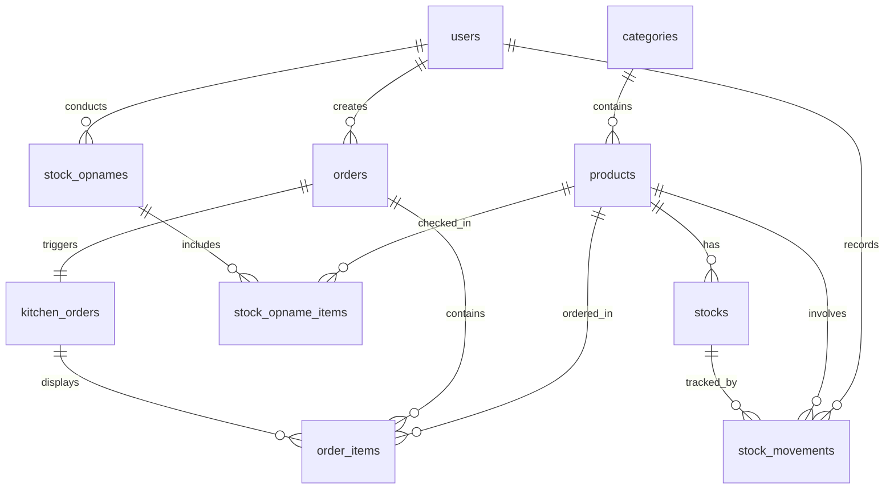

# Desain Sistem POS UMKM

> Dokumentasi lengkap arsitektur sistem Point of Sales untuk UMKM (Warung, Café, Restoran Kecil)

**Stack Teknologi:**
- Backend: Node.js (NestJS/Express)
- ORM: Prisma
- Database: PostgreSQL
- Realtime: WebSocket
- Skala: Single Outlet

---

## 1. ERD (Entity Relationship Diagram)

### Diagram Relasi Antar Tabel



### Detail Entitas dan Relasi

#### **1. users**
Tabel untuk menyimpan data pengguna sistem dengan berbagai role.

| Field | Type | Description |
|-------|------|-------------|
| `id` | UUID | Primary key |
| `name` | String | Nama lengkap user |
| `email` | String (unique) | Email login |
| `password` | String (hashed) | Password terenkripsi |
| `role` | Enum | OWNER, ADMIN, CASHIER |
| `is_active` | Boolean | Status aktif user |
| `created_at` | DateTime | Waktu pembuatan |
| `updated_at` | DateTime | Waktu update terakhir |

**Fungsi:** Mengelola autentikasi, autorisasi, dan audit trail untuk semua aktivitas sistem.

---

#### **2. categories**
Tabel kategori produk untuk pengelompokan menu/barang.

| Field | Type | Description |
|-------|------|-------------|
| `id` | UUID | Primary key |
| `name` | String (unique) | Nama kategori (misal: Makanan, Minuman) |
| `description` | Text (nullable) | Deskripsi kategori |
| `created_at` | DateTime | Waktu pembuatan |
| `updated_at` | DateTime | Waktu update terakhir |

**Fungsi:** Organisasi produk untuk mempermudah navigasi kasir dan laporan penjualan per kategori.

---

#### **3. products**
Tabel master produk/menu yang dijual.

| Field | Type | Description |
|-------|------|-------------|
| `id` | UUID | Primary key |
| `category_id` | UUID | Foreign key ke categories |
| `name` | String | Nama produk |
| `sku` | String (unique, nullable) | Stock Keeping Unit |
| `price` | Decimal(10,2) | Harga jual |
| `cost` | Decimal(10,2) | Harga modal (untuk laporan profit) |
| `description` | Text (nullable) | Deskripsi produk |
| `image_url` | String (nullable) | URL gambar produk |
| `is_available` | Boolean | Ketersediaan untuk dijual |
| `created_at` | DateTime | Waktu pembuatan |
| `updated_at` | DateTime | Waktu update terakhir |

**Fungsi:** Master data menu/produk yang menjadi referensi untuk transaksi dan stok.

---

#### **4. stocks**
Tabel stok real-time untuk setiap produk.

| Field | Type | Description |
|-------|------|-------------|
| `id` | UUID | Primary key |
| `product_id` | UUID (unique) | Foreign key ke products |
| `quantity` | Integer | Jumlah stok saat ini |
| `min_stock` | Integer | Batas minimum stok (alert) |
| `updated_at` | DateTime | Waktu update terakhir |

**Fungsi:** Menyimpan jumlah stok terkini. Diupdate otomatis saat transaksi atau pergerakan stok.

> [!IMPORTANT]
> Stok hanya menyimpan **quantity saat ini**, TIDAK menyimpan history. History ada di `stock_movements`.

---

#### **5. stock_movements**
Tabel history pergerakan stok (audit trail).

| Field | Type | Description |
|-------|------|-------------|
| `id` | UUID | Primary key |
| `product_id` | UUID | Foreign key ke products |
| `stock_id` | UUID | Foreign key ke stocks |
| `user_id` | UUID | Foreign key ke users (pelaku) |
| `type` | Enum | IN (masuk), OUT (keluar), ADJUST (koreksi) |
| `quantity` | Integer | Jumlah perubahan (+ atau -) |
| `before_qty` | Integer | Stok sebelum perubahan |
| `after_qty` | Integer | Stok setelah perubahan |
| `notes` | Text (nullable) | Catatan pergerakan |
| `reference_id` | UUID (nullable) | Referensi ke order_id jika OUT dari penjualan |
| `created_at` | DateTime | Waktu transaksi |

**Fungsi:** Audit trail lengkap untuk tracking semua perubahan stok (IN/OUT/ADJUST).

---

#### **6. orders**
Tabel transaksi penjualan.

| Field | Type | Description |
|-------|------|-------------|
| `id` | UUID | Primary key |
| `order_number` | String (unique) | Nomor invoice (misal: INV-20260217-0001) |
| `cashier_id` | UUID | Foreign key ke users |
| `customer_name` | String (nullable) | Nama pelanggan |
| `order_type` | Enum | DINE_IN, TAKEAWAY, DELIVERY |
| `table_number` | String (nullable) | Nomor meja jika dine-in |
| `subtotal` | Decimal(10,2) | Total sebelum pajak |
| `tax` | Decimal(10,2) | Pajak (jika ada) |
| `discount` | Decimal(10,2) | Diskon |
| `total` | Decimal(10,2) | Total yang dibayar |
| `payment_method` | Enum | CASH, DEBIT, QRIS, TRANSFER |
| `status` | Enum | PENDING, COMPLETED, CANCELLED |
| `created_at` | DateTime | Waktu order dibuat |
| `completed_at` | DateTime (nullable) | Waktu order selesai |

**Fungsi:** Menyimpan header transaksi penjualan untuk invoice dan laporan.

---

#### **7. order_items**
Tabel detail item dalam setiap order.

| Field | Type | Description |
|-------|------|-------------|
| `id` | UUID | Primary key |
| `order_id` | UUID | Foreign key ke orders |
| `product_id` | UUID | Foreign key ke products |
| `quantity` | Integer | Jumlah item |
| `price` | Decimal(10,2) | Harga saat transaksi (snapshot) |
| `subtotal` | Decimal(10,2) | quantity × price |
| `notes` | Text (nullable) | Catatan khusus (misal: tanpa es) |
| `created_at` | DateTime | Waktu item ditambahkan |

**Fungsi:** Detail produk yang dipesan, dengan snapshot harga untuk menghindari perubahan harga retroaktif.

---

#### **8. kitchen_orders**
Tabel untuk Kitchen Display System (KDS).

| Field | Type | Description |
|-------|------|-------------|
| `id` | UUID | Primary key |
| `order_id` | UUID (unique) | Foreign key ke orders |
| `order_number` | String | Nomor order (denormalisasi untuk performa) |
| `table_number` | String (nullable) | Nomor meja |
| `status` | Enum | PENDING, COOKING, DONE, CANCELLED |
| `priority` | Integer | Urutan prioritas (default: 0) |
| `started_at` | DateTime (nullable) | Waktu mulai masak |
| `completed_at` | DateTime (nullable) | Waktu selesai masak |
| `created_at` | DateTime | Waktu order masuk dapur |
| `updated_at` | DateTime | Waktu update status |

**Fungsi:** Menampilkan antrian pesanan di dapur dengan status real-time via WebSocket.

---

#### **9. stock_opnames**
Tabel header untuk stok opname (pencatatan fisik stok).

| Field | Type | Description |
|-------|------|-------------|
| `id` | UUID | Primary key |
| `opname_number` | String (unique) | Nomor stok opname (misal: SO-20260217) |
| `user_id` | UUID | Foreign key ke users (pelaksana) |
| `notes` | Text (nullable) | Catatan kegiatan opname |
| `status` | Enum | DRAFT, COMPLETED |
| `created_at` | DateTime | Waktu mulai opname |
| `completed_at` | DateTime (nullable) | Waktu opname selesai |

**Fungsi:** Header untuk kegiatan stock opname berkala.

---

#### **10. stock_opname_items**
Tabel detail item dalam stok opname.

| Field | Type | Description |
|-------|------|-------------|
| `id` | UUID | Primary key |
| `opname_id` | UUID | Foreign key ke stock_opnames |
| `product_id` | UUID | Foreign key ke products |
| `system_qty` | Integer | Stok menurut sistem |
| `actual_qty` | Integer | Stok hasil hitung fisik |
| `difference` | Integer | Selisih (actual - system) |
| `notes` | Text (nullable) | Catatan perbedaan |
| `created_at` | DateTime | Waktu pencatatan |

**Fungsi:** Detail hasil penghitungan fisik vs sistem. Selisih akan menghasilkan stock adjustment.

---

## 2. Prisma Schema

```prisma
// prisma/schema.prisma

generator client {
  provider = "prisma-client-js"
}

datasource db {
  provider = "postgresql"
  url      = env("DATABASE_URL")
}

// ===========================
// ENUMS
// ===========================

enum UserRole {
  OWNER
  ADMIN
  CASHIER
}

enum OrderType {
  DINE_IN
  TAKEAWAY
  DELIVERY
}

enum PaymentMethod {
  CASH
  DEBIT
  QRIS
  TRANSFER
}

enum OrderStatus {
  PENDING
  COMPLETED
  CANCELLED
}

enum KitchenStatus {
  PENDING
  COOKING
  DONE
  CANCELLED
}

enum StockMovementType {
  IN
  OUT
  ADJUST
}

enum StockOpnameStatus {
  DRAFT
  COMPLETED
}

// ===========================
// MODELS
// ===========================

model User {
  id        String   @id @default(uuid()) @db.Uuid
  name      String
  email     String   @unique
  password  String
  role      UserRole @default(CASHIER)
  isActive  Boolean  @default(true) @map("is_active")
  createdAt DateTime @default(now()) @map("created_at")
  updatedAt DateTime @updatedAt @map("updated_at")

  // Relations
  orders         Order[]
  stockMovements StockMovement[]
  stockOpnames   StockOpname[]

  @@map("users")
}

model Category {
  id          String    @id @default(uuid()) @db.Uuid
  name        String    @unique
  description String?   @db.Text
  createdAt   DateTime  @default(now()) @map("created_at")
  updatedAt   DateTime  @updatedAt @map("updated_at")

  // Relations
  products Product[]

  @@map("categories")
}

model Product {
  id          String   @id @default(uuid()) @db.Uuid
  categoryId  String   @map("category_id") @db.Uuid
  name        String
  sku         String?  @unique
  price       Decimal  @db.Decimal(10, 2)
  cost        Decimal  @db.Decimal(10, 2)
  description String?  @db.Text
  imageUrl    String?  @map("image_url")
  isAvailable Boolean  @default(true) @map("is_available")
  createdAt   DateTime @default(now()) @map("created_at")
  updatedAt   DateTime @updatedAt @map("updated_at")

  // Relations
  category         Category           @relation(fields: [categoryId], references: [id], onDelete: Cascade)
  stock            Stock?
  orderItems       OrderItem[]
  stockMovements   StockMovement[]
  stockOpnameItems StockOpnameItem[]

  @@index([categoryId])
  @@map("products")
}

model Stock {
  id        String   @id @default(uuid()) @db.Uuid
  productId String   @unique @map("product_id") @db.Uuid
  quantity  Int      @default(0)
  minStock  Int      @default(5) @map("min_stock")
  updatedAt DateTime @updatedAt @map("updated_at")

  // Relations
  product        Product         @relation(fields: [productId], references: [id], onDelete: Cascade)
  stockMovements StockMovement[]

  @@map("stocks")
}

model StockMovement {
  id          String            @id @default(uuid()) @db.Uuid
  productId   String            @map("product_id") @db.Uuid
  stockId     String            @map("stock_id") @db.Uuid
  userId      String            @map("user_id") @db.Uuid
  type        StockMovementType
  quantity    Int
  beforeQty   Int               @map("before_qty")
  afterQty    Int               @map("after_qty")
  notes       String?           @db.Text
  referenceId String?           @map("reference_id") @db.Uuid
  createdAt   DateTime          @default(now()) @map("created_at")

  // Relations
  product Product @relation(fields: [productId], references: [id], onDelete: Cascade)
  stock   Stock   @relation(fields: [stockId], references: [id], onDelete: Cascade)
  user    User    @relation(fields: [userId], references: [id])

  @@index([productId])
  @@index([stockId])
  @@index([userId])
  @@index([type])
  @@index([createdAt])
  @@map("stock_movements")
}

model Order {
  id            String        @id @default(uuid()) @db.Uuid
  orderNumber   String        @unique @map("order_number")
  cashierId     String        @map("cashier_id") @db.Uuid
  customerName  String?       @map("customer_name")
  orderType     OrderType     @default(DINE_IN) @map("order_type")
  tableNumber   String?       @map("table_number")
  subtotal      Decimal       @db.Decimal(10, 2)
  tax           Decimal       @default(0) @db.Decimal(10, 2)
  discount      Decimal       @default(0) @db.Decimal(10, 2)
  total         Decimal       @db.Decimal(10, 2)
  paymentMethod PaymentMethod @map("payment_method")
  status        OrderStatus   @default(PENDING)
  createdAt     DateTime      @default(now()) @map("created_at")
  completedAt   DateTime?     @map("completed_at")

  // Relations
  cashier      User          @relation(fields: [cashierId], references: [id])
  orderItems   OrderItem[]
  kitchenOrder KitchenOrder?

  @@index([cashierId])
  @@index([status])
  @@index([createdAt])
  @@map("orders")
}

model OrderItem {
  id        String   @id @default(uuid()) @db.Uuid
  orderId   String   @map("order_id") @db.Uuid
  productId String   @map("product_id") @db.Uuid
  quantity  Int
  price     Decimal  @db.Decimal(10, 2)
  subtotal  Decimal  @db.Decimal(10, 2)
  notes     String?  @db.Text
  createdAt DateTime @default(now()) @map("created_at")

  // Relations
  order   Order   @relation(fields: [orderId], references: [id], onDelete: Cascade)
  product Product @relation(fields: [productId], references: [id])

  @@index([orderId])
  @@index([productId])
  @@map("order_items")
}

model KitchenOrder {
  id          String        @id @default(uuid()) @db.Uuid
  orderId     String        @unique @map("order_id") @db.Uuid
  orderNumber String        @map("order_number")
  tableNumber String?       @map("table_number")
  status      KitchenStatus @default(PENDING)
  priority    Int           @default(0)
  startedAt   DateTime?     @map("started_at")
  completedAt DateTime?     @map("completed_at")
  createdAt   DateTime      @default(now()) @map("created_at")
  updatedAt   DateTime      @updatedAt @map("updated_at")

  // Relations
  order Order @relation(fields: [orderId], references: [id], onDelete: Cascade)

  @@index([status])
  @@index([priority])
  @@index([createdAt])
  @@map("kitchen_orders")
}

model StockOpname {
  id            String             @id @default(uuid()) @db.Uuid
  opnameNumber  String             @unique @map("opname_number")
  userId        String             @map("user_id") @db.Uuid
  notes         String?            @db.Text
  status        StockOpnameStatus  @default(DRAFT)
  createdAt     DateTime           @default(now()) @map("created_at")
  completedAt   DateTime?          @map("completed_at")

  // Relations
  user  User              @relation(fields: [userId], references: [id])
  items StockOpnameItem[]

  @@index([userId])
  @@index([status])
  @@map("stock_opnames")
}

model StockOpnameItem {
  id         String   @id @default(uuid()) @db.Uuid
  opnameId   String   @map("opname_id") @db.Uuid
  productId  String   @map("product_id") @db.Uuid
  systemQty  Int      @map("system_qty")
  actualQty  Int      @map("actual_qty")
  difference Int
  notes      String?  @db.Text
  createdAt  DateTime @default(now()) @map("created_at")

  // Relations
  opname  StockOpname @relation(fields: [opnameId], references: [id], onDelete: Cascade)
  product Product     @relation(fields: [productId], references: [id])

  @@index([opnameId])
  @@index([productId])
  @@map("stock_opname_items")
}
```

---

## 3. Flow API POS

### A. Flow Kasir (Cashier)

#### **1. Buat Order Baru**
```http
POST /api/orders
Authorization: Bearer {token}
Content-Type: application/json

{
  "customerName": "Budi Santoso",
  "orderType": "DINE_IN",
  "tableNumber": "A5",
  "items": [
    {
      "productId": "uuid-product-1",
      "quantity": 2,
      "notes": "Tanpa es"
    },
    {
      "productId": "uuid-product-2",
      "quantity": 1
    }
  ],
  "paymentMethod": "CASH",
  "discount": 0
}
```

**Response:**
```json
{
  "success": true,
  "data": {
    "id": "uuid-order-123",
    "orderNumber": "INV-20260217-0001",
    "subtotal": 45000,
    "tax": 4500,
    "discount": 0,
    "total": 49500,
    "status": "PENDING",
    "createdAt": "2026-02-17T13:00:00Z"
  }
}
```

**Backend Logic:**
1. Validasi stok produk (cek `stocks.quantity`)
2. Hitung subtotal, tax, total
3. Buat record di tabel `orders`
4. Buat record di tabel `order_items` untuk setiap item
5. Kurangi stok di tabel `stocks`
6. Catat di `stock_movements` (type: OUT)
7. Trigger WebSocket ke dapur (buat `kitchen_orders`)

---

#### **2. Konfirmasi Pembayaran**
```http
PATCH /api/orders/{orderId}/complete
Authorization: Bearer {token}

{
  "paymentMethod": "CASH",
  "paidAmount": 50000
}
```

**Response:**
```json
{
  "success": true,
  "data": {
    "id": "uuid-order-123",
    "status": "COMPLETED",
    "change": 500,
    "completedAt": "2026-02-17T13:05:00Z"
  }
}
```

---

#### **3. Cancel Order**
```http
PATCH /api/orders/{orderId}/cancel
Authorization: Bearer {token}

{
  "reason": "Customer cancelled"
}
```

**Backend Logic:**
1. Update status order menjadi `CANCELLED`
2. Kembalikan stok (type: IN via `stock_movements`)
3. Update `kitchen_orders` status menjadi `CANCELLED`
4. Trigger WebSocket update ke dapur

---

### B. Flow Dapur (Kitchen Display System)

#### **1. Get Active Kitchen Orders**
```http
GET /api/kitchen/orders?status=PENDING,COOKING
Authorization: Bearer {token}
```

**Response:**
```json
{
  "success": true,
  "data": [
    {
      "id": "uuid-kitchen-1",
      "orderNumber": "INV-20260217-0001",
      "tableNumber": "A5",
      "status": "PENDING",
      "priority": 1,
      "items": [
        {
          "productName": "Nasi Goreng",
          "quantity": 2,
          "notes": "Tanpa es"
        }
      ],
      "createdAt": "2026-02-17T13:00:00Z",
      "elapsedTime": "5m 23s"
    }
  ]
}
```

---

#### **2. Update Kitchen Order Status**
```http
PATCH /api/kitchen/orders/{kitchenOrderId}/status
Authorization: Bearer {token}

{
  "status": "COOKING"
}
```

**Response:**
```json
{
  "success": true,
  "data": {
    "id": "uuid-kitchen-1",
    "status": "COOKING",
    "startedAt": "2026-02-17T13:02:00Z"
  }
}
```

**WebSocket Event:**
```json
{
  "event": "kitchen:status-updated",
  "data": {
    "orderId": "uuid-order-123",
    "status": "COOKING"
  }
}
```

---

#### **3. Mark Order as Done**
```http
PATCH /api/kitchen/orders/{kitchenOrderId}/status
Authorization: Bearer {token}

{
  "status": "DONE"
}
```

**WebSocket Event:**
```json
{
  "event": "kitchen:order-completed",
  "data": {
    "orderId": "uuid-order-123",
    "orderNumber": "INV-20260217-0001",
    "completedAt": "2026-02-17T13:10:00Z"
  }
}
```

---

### C. Flow Laporan

#### **1. Laporan Penjualan Harian**
```http
GET /api/reports/sales/daily?date=2026-02-17
Authorization: Bearer {token}
```

**Response:**
```json
{
  "success": true,
  "data": {
    "date": "2026-02-17",
    "totalOrders": 35,
    "totalRevenue": 1750000,
    "totalProfit": 525000,
    "paymentBreakdown": {
      "CASH": 1200000,
      "QRIS": 550000
    },
    "orderTypeBreakdown": {
      "DINE_IN": 25,
      "TAKEAWAY": 10
    }
  }
}
```

**SQL Query (contoh):**
```sql
SELECT 
  COUNT(*) as total_orders,
  SUM(total) as total_revenue,
  SUM((oi.price - p.cost) * oi.quantity) as total_profit
FROM orders o
LEFT JOIN order_items oi ON o.id = oi.order_id
LEFT JOIN products p ON oi.product_id = p.id
WHERE DATE(o.created_at) = '2026-02-17'
  AND o.status = 'COMPLETED';
```

---

#### **2. Produk Terlaris**
```http
GET /api/reports/products/best-sellers?startDate=2026-02-01&endDate=2026-02-17
Authorization: Bearer {token}
```

**Response:**
```json
{
  "success": true,
  "data": [
    {
      "productId": "uuid-product-1",
      "productName": "Nasi Goreng Spesial",
      "totalQuantity": 125,
      "totalRevenue": 1875000,
      "orderCount": 85
    },
    {
      "productId": "uuid-product-2",
      "productName": "Es Teh Manis",
      "totalQuantity": 200,
      "totalRevenue": 1000000,
      "orderCount": 150
    }
  ]
}
```

---

#### **3. Laporan Stok**
```http
GET /api/reports/stocks?lowStock=true
Authorization: Bearer {token}
```

**Response:**
```json
{
  "success": true,
  "data": [
    {
      "productId": "uuid-product-5",
      "productName": "Kentang Goreng",
      "currentStock": 3,
      "minStock": 10,
      "status": "LOW_STOCK"
    }
  ]
}
```

---

#### **4. Riwayat Pergerakan Stok**
```http
GET /api/reports/stock-movements?productId={uuid}&startDate=2026-02-01
Authorization: Bearer {token}
```

**Response:**
```json
{
  "success": true,
  "data": [
    {
      "id": "uuid-movement-1",
      "type": "IN",
      "quantity": 50,
      "beforeQty": 10,
      "afterQty": 60,
      "notes": "Restock dari supplier",
      "createdAt": "2026-02-15T10:00:00Z",
      "user": "Admin User"
    },
    {
      "id": "uuid-movement-2",
      "type": "OUT",
      "quantity": -2,
      "beforeQty": 60,
      "afterQty": 58,
      "notes": "Penjualan via order INV-20260217-0001",
      "createdAt": "2026-02-17T13:00:00Z",
      "user": "Kasir 1"
    }
  ]
}
```

---

## 4. Role & Permission System

### Hak Akses Per Role

| Fitur | OWNER | ADMIN | CASHIER |
|-------|-------|-------|---------|
| **Kasir** | | | |
| Buat order | ✅ | ✅ | ✅ |
| Cancel order | ✅ | ✅ | ⛔ |
| Lihat history order | ✅ | ✅ | ✅ (hanya miliknya) |
| **Kitchen** | | | |
| Lihat KDS | ✅ | ✅ | ⛔ |
| Update status KDS | ✅ | ✅ | ⛔ |
| **Produk** | | | |
| Tambah/edit produk | ✅ | ✅ | ⛔ |
| Hapus produk | ✅ | ⛔ | ⛔ |
| **Stok** | | | |
| Lihat stok | ✅ | ✅ | ✅ (read-only) |
| Stok IN/OUT/ADJUST | ✅ | ✅ | ⛔ |
| Stok opname | ✅ | ✅ | ⛔ |
| **Laporan** | | | |
| Laporan penjualan | ✅ | ✅ | ⛔ |
| Laporan profit | ✅ | ⛔ | ⛔ |
| Laporan stok | ✅ | ✅ | ⛔ |
| **User Management** | | | |
| Tambah/edit user | ✅ | ⛔ | ⛔ |
| Hapus user | ✅ | ⛔ | ⛔ |

---

### Implementasi Middleware (NestJS Example)

#### **Role Guard**
```typescript
// guards/roles.guard.ts
import { Injectable, CanActivate, ExecutionContext } from '@nestjs/common';
import { Reflector } from '@nestjs/core';
import { UserRole } from '@prisma/client';

@Injectable()
export class RolesGuard implements CanActivate {
  constructor(private reflector: Reflector) {}

  canActivate(context: ExecutionContext): boolean {
    const requiredRoles = this.reflector.getAllAndOverride<UserRole[]>('roles', [
      context.getHandler(),
      context.getClass(),
    ]);

    if (!requiredRoles) {
      return true; // Tidak ada role requirement = public
    }

    const { user } = context.switchToHttp().getRequest();
    return requiredRoles.includes(user.role);
  }
}
```

#### **Decorator untuk Role**
```typescript
// decorators/roles.decorator.ts
import { SetMetadata } from '@nestjs/common';
import { UserRole } from '@prisma/client';

export const Roles = (...roles: UserRole[]) => SetMetadata('roles', roles);
```

#### **Penggunaan di Controller**
```typescript
// orders.controller.ts
import { Controller, Post, Patch, UseGuards } from '@nestjs/common';
import { JwtAuthGuard } from './guards/jwt-auth.guard';
import { RolesGuard } from './guards/roles.guard';
import { Roles } from './decorators/roles.decorator';
import { UserRole } from '@prisma/client';

@Controller('orders')
@UseGuards(JwtAuthGuard, RolesGuard)
export class OrdersController {
  
  @Post()
  @Roles(UserRole.OWNER, UserRole.ADMIN, UserRole.CASHIER)
  createOrder() {
    // Semua role bisa buat order
  }

  @Patch(':id/cancel')
  @Roles(UserRole.OWNER, UserRole.ADMIN)
  cancelOrder() {
    // Hanya Owner & Admin bisa cancel
  }
}
```

---

## 5. Best Practices

### A. Audit Stok

> [!IMPORTANT]
> Setiap perubahan stok **WAJIB** tercatat di `stock_movements`.

**Implementasi dengan Prisma Transaction:**
```typescript
async reduceStock(productId: string, quantity: number, userId: string, orderId: string) {
  return await this.prisma.$transaction(async (tx) => {
    // 1. Ambil stok saat ini
    const stock = await tx.stock.findUnique({
      where: { productId },
    });

    if (!stock || stock.quantity < quantity) {
      throw new Error('Stok tidak mencukupi');
    }

    const beforeQty = stock.quantity;
    const afterQty = beforeQty - quantity;

    // 2. Update stok
    await tx.stock.update({
      where: { id: stock.id },
      data: { quantity: afterQty },
    });

    // 3. Catat movement
    await tx.stockMovement.create({
      data: {
        productId,
        stockId: stock.id,
        userId,
        type: 'OUT',
        quantity: -quantity,
        beforeQty,
        afterQty,
        referenceId: orderId,
        notes: `Penjualan via order`,
      },
    });

    return { success: true, afterQty };
  });
}
```

---

### B. Konsistensi Data Transaksi

> [!CAUTION]
> Gunakan **database transaction** untuk semua operasi order yang melibatkan multiple tables.

**Contoh Transaction untuk Create Order:**
```typescript
async createOrder(orderData: CreateOrderDto, userId: string) {
  return await this.prisma.$transaction(async (tx) => {
    // 1. Buat order header
    const order = await tx.order.create({
      data: {
        orderNumber: await this.generateOrderNumber(),
        cashierId: userId,
        customerName: orderData.customerName,
        orderType: orderData.orderType,
        tableNumber: orderData.tableNumber,
        subtotal: orderData.subtotal,
        tax: orderData.tax,
        discount: orderData.discount,
        total: orderData.total,
        paymentMethod: orderData.paymentMethod,
        status: 'PENDING',
      },
    });

    // 2. Buat order items
    for (const item of orderData.items) {
      await tx.orderItem.create({
        data: {
          orderId: order.id,
          productId: item.productId,
          quantity: item.quantity,
          price: item.price,
          subtotal: item.subtotal,
          notes: item.notes,
        },
      });

      // 3. Kurangi stok
      await this.reduceStock(item.productId, item.quantity, userId, order.id);
    }

    // 4. Trigger kitchen order
    await tx.kitchenOrder.create({
      data: {
        orderId: order.id,
        orderNumber: order.orderNumber,
        tableNumber: order.tableNumber,
        status: 'PENDING',
      },
    });

    return order;
  });
}
```

---

### C. Error Handling

**Standardisasi Response Error:**
```typescript
// exception-filters/http-exception.filter.ts
import { ExceptionFilter, Catch, ArgumentsHost, HttpException } from '@nestjs/common';

@Catch(HttpException)
export class HttpExceptionFilter implements ExceptionFilter {
  catch(exception: HttpException, host: ArgumentsHost) {
    const ctx = host.switchToHttp();
    const response = ctx.getResponse();
    const status = exception.getStatus();
    const exceptionResponse = exception.getResponse();

    response.status(status).json({
      success: false,
      statusCode: status,
      message: exceptionResponse['message'] || 'Internal server error',
      timestamp: new Date().toISOString(),
    });
  }
}
```

**Custom Business Logic Exceptions:**
```typescript
// exceptions/insufficient-stock.exception.ts
import { HttpException, HttpStatus } from '@nestjs/common';

export class InsufficientStockException extends HttpException {
  constructor(productName: string, available: number, requested: number) {
    super(
      {
        message: `Stok ${productName} tidak mencukupi. Tersedia: ${available}, Diminta: ${requested}`,
        code: 'INSUFFICIENT_STOCK',
      },
      HttpStatus.BAD_REQUEST,
    );
  }
}
```

---

### D. Skalabilitas Multi Outlet

Untuk persiapan scaling ke multi-outlet di masa depan:

#### **1. Tambahkan tabel `outlets`**
```prisma
model Outlet {
  id        String   @id @default(uuid()) @db.Uuid
  name      String
  address   String
  phone     String
  isActive  Boolean  @default(true)
  createdAt DateTime @default(now())
  updatedAt DateTime @updatedAt

  // Relations
  orders  Order[]
  stocks  Stock[]
  users   User[]

  @@map("outlets")
}
```

#### **2. Modifikasi tabel existing**
- Tambahkan `outletId` di `orders`, `stocks`, `users`
- Buat **composite index** `(outletId, productId)` di `stocks`
- Filter semua query berdasarkan `outletId`

#### **3. Centralized vs Distributed Stock**
- **Centralized:** 1 database untuk semua outlet (gunakan `outletId` untuk segregasi)
- **Distributed:** 1 database per outlet (lebih kompleks, butuh sync mechanism)

**Rekomendasi:** Mulai dengan **centralized + outletId**, lebih simple untuk UMKM.

---

### E. Performance Optimization

#### **1. Database Indexing**
Pastikan index sudah ada di kolom yang sering di-query:
```prisma
@@index([cashierId])
@@index([status])
@@index([createdAt])
@@index([productId, createdAt])
```

#### **2. Caching untuk Master Data**
```typescript
// Gunakan Redis untuk cache products & categories
async getProducts() {
  const cacheKey = 'products:all';
  const cached = await this.redis.get(cacheKey);
  
  if (cached) {
    return JSON.parse(cached);
  }

  const products = await this.prisma.product.findMany({
    include: { category: true, stock: true },
  });

  await this.redis.setex(cacheKey, 3600, JSON.stringify(products)); // Cache 1 jam
  return products;
}
```

#### **3. WebSocket Optimization**
- Gunakan **rooms** untuk grouping client (misal: room per outlet)
- Broadcast hanya ke client yang relevan
- Implement **reconnection logic** di client

---

### F. Backup & Recovery

> [!WARNING]
> Data transaksi adalah aset bisnis yang krusial.

**Strategi Backup:**
1. **Automated Daily Backup** via `pg_dump`
   ```bash
   pg_dump -U postgres -d pos_db > backup_$(date +%Y%m%d).sql
   ```

2. **Point-in-Time Recovery** (PITR) dengan PostgreSQL WAL

3. **Cloud Backup** (S3, Google Cloud Storage) untuk disaster recovery

4. **Test Restore** minimal sebulan sekali

---

### G. Monitoring & Alerting

**Metrics yang perlu dimonitor:**
- Stock low alert (via cron job)
- Failed transactions
- WebSocket connection drops
- Database connection pool usage
- API response time

**Tools:**
- Logging: Winston + ELK Stack
- Monitoring: Prometheus + Grafana
- Error Tracking: Sentry

---

## Ringkasan

Desain sistem POS ini sudah production-ready dengan fitur:

✅ **ERD lengkap** dengan 10 tabel terstruktur  
✅ **Prisma schema** siap migrasi dengan UUID & enum  
✅ **API flow** untuk kasir, dapur, dan laporan  
✅ **Role-based access control** untuk 3 role  
✅ **Best practices** untuk audit, konsistensi, error handling, dan skalabilitas  

**Next Steps:**
1. Setup project NestJS + Prisma
2. Run migration: `npx prisma migrate dev`
3. Seed initial data (admin user, categories)
4. Implement API endpoints
5. Setup WebSocket gateway untuk KDS
6. Deploy ke VPS (PM2 + Nginx)

Sistem ini bisa langsung dipakai untuk UMKM single outlet, dan siap scale ke multi-outlet dengan penambahan tabel `outlets`.
